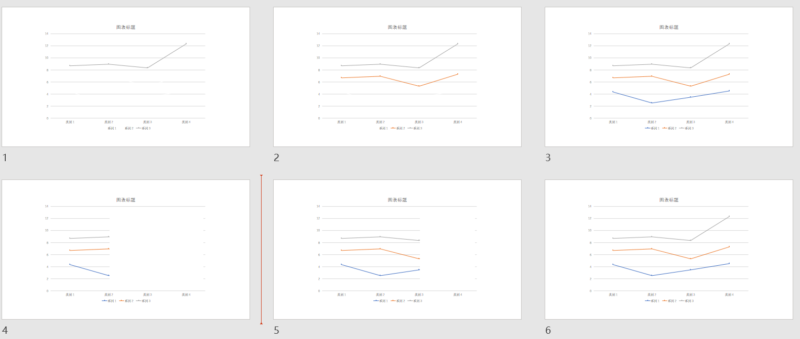

- ## 幻灯片的组织结构
  collapsed:: true
	- ((63ce51b7-fa20-4ab5-b2a0-892c7cb69e5c))
	  collapsed:: true
		- >Schwabish J. Better Presentations: A Guide for Scholars, Researchers, and Wonks[M]. Columbia University Press, 2016.
- 学术作品通常是按照“引言->回顾->方法->分析->结论”组织的。
- 文章的篇章组织通常采用“金字塔结构”，即引言和回顾篇幅最少，方法和分析篇幅最多。这种篇章组织方式有利于读者逐渐加深理解，但速度太慢。考虑到现场演说时间的制约，提出问题比回答问题更为重要且实际，所以学术幻灯片建议使用“沙漏型”的篇章组织，即加重引言和结论部分的比例，压缩方法和分析的篇幅。(J. Schwabish, 2016, 章 1)
- ## 读图和看图的区别
  collapsed:: true
	- ((63ce51b7-fa20-4ab5-b2a0-892c7cb69e5c))
	  collapsed:: true
		- >Schwabish J. Better Presentations: A Guide for Scholars, Researchers, and Wonks[M]. Columbia University Press, 2016.
		- > ((63ce5ac5-85d3-42a3-9ba8-4ccfecb7ee80))
- 因为读文章没有外部时间限制，所以图片通常会做得比较复杂，读者需要仔细阅读。学术演说有严格的时间限制，再加上清晰度等因素的影响，没有条件供读者仔细读图，所以**千万不要把文章里的图直接放在幻灯片里**，必须简化到一看便知的程度，建议配合渐次呈现的方法展示复杂图片。 (J. Schwabish, 2016, 章 1)
- 使用柱状图代替饼图表示比例，不要使用3D信息图，这些图都不方便看。 (J. Schwabish, 2016, 章 5)
- 表格也应该视为一种“图”，需要用颜色、字体等加强，而不只是白底黑字。 (J. Schwabish, 2016, 章 5)
- ## 配色 (续)
  collapsed:: true
	- ((63c3d154-7194-4f50-bce4-f92182343bf0))
	  collapsed:: true
		- >Schwabish J. Better Presentations: A Guide for Scholars, Researchers, and Wonks[M]. Columbia University Press, 2016.
- 幻灯片配色的核心依据是对比度。高对比度的四种配色方案是：渐变单色系、互补色系、相邻色系和无色系。考虑到学术幻灯片通常使用白底黑字以及色盲人群的不便，这四种色系中比较推荐无色系，即黑白灰+一种亮色。 (J. Schwabish, 2016, 章 2)
- ## 渐次呈现 (LAYERING APPROACH)
  id:: 63ce5ac5-85d3-42a3-9ba8-4ccfecb7ee80
  collapsed:: true
	- ((63ce51b7-fa20-4ab5-b2a0-892c7cb69e5c))
	  collapsed:: true
		- >Schwabish J. Better Presentations: A Guide for Scholars, Researchers, and Wonks[M]. Columbia University Press, 2016.
- 对于复杂内容，可以使用“渐次呈现”(J. Schwabish, 2016, 章 4和5)的方法展示。比如将一幅有三条线段的折线图分解为三页幻灯片，逐次呈现每一条线段。
- 划分渐次呈现的依据不是组成图片的元素，而是想要表达的东西。比如一幅有三条折线的折线图，每条折线都有“升-平-升”三个阶段，那么我既可以是渐次呈现每条折线，也可以渐次呈现三条折线的三个阶段。如下图
  
- 对于信息图，可以先呈现图的坐标轴，然后再呈现内容