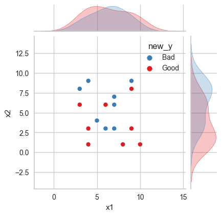

- ## sns绘制jointplot
  collapsed:: true
	- ((63ecba55-d584-42b4-86ec-916e1116ee13))
	  collapsed:: true
		- collapsed:: true
		  >参考
			- [Seaborn分布数据可视化---散点分布图 - 溪奇的数据 - 博客园](https://www.cnblogs.com/xiqi2018/p/15774599.html)
			- [【seaborn】jointplot 改变图片长宽比，非方形_seaborn 热力图设置方块长宽_老光头_ME2CS的博客-CSDN博客](https://blog.csdn.net/Forrest97/article/details/113091457)
			- [Seaborn-05-Pairplot多变量图 - 简书](https://www.jianshu.com/p/6e18d21a4cad)
- ``` Python
  # 生成两列随机数
  col1 = np.random.randint(1, 11, size=20)
  col2 = np.random.randint(1, 11, size=20)
  col3 = np.random.randint(0, 2, size=20)
  
  # 将两列随机数组合成 DataFrame
  df = pd.DataFrame({'x1': col1, 'x2': col2, 'y':col3})
  
  #重映射y列，实现重命名
  mapping_dict = {0: 'Good', 1: 'Bad'}
  df['new_y'] = df['y'].map(mapping_dict)
  
  # 获取当前调色板的颜色列表以实现手动选择颜色
  colors = sns.color_palette('Set1') #第一个颜色是红色，第二个颜色是蓝色
  
  #绘图
  grid = sns.jointplot(
      x='x1', 
      y='x2',#设置x和y轴的数据
      data=df,#设置数据
      s=50,
      edgecolor='w',linewidth=1,#散点大小、边缘线颜色和宽度（只针对scatter）
      kind='scatter',#默认类型：“scatter”，其他有“reg”、“resid”、“kde” 
      hue='new_y',
      space=0.2, #设置散点图和布局图的间距
      height=8,#图表的大小（自动调整为正方形）
      ratio=5,#散点图与布局图高度比率
      #stat_func= sci.pearsonr,#pearson相关系数           
      #marginal_kws=dict(bins=15, rug=True),#边际图的参数
      palette=[colors[1],colors[0]],#倒置颜色，否则Bad为红色，Good为蓝色
  )
  grid.fig.set_figwidth(4) #控制宽度
  grid.fig.set_figheight(4) #控制高度
  ```
- 