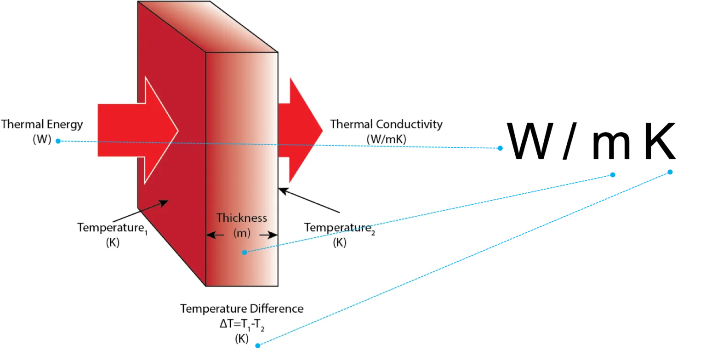

## 热阻和热导率
collapsed:: true
	- ((66330e73-0d78-4a79-bbfc-ce8659a2720d))
- 热导率是材料的属性，和几何形状无关，单位是w/m*k [Why are the Units for Thermal Conductivity W/m-K?](https://ctherm.com/resources/newsroom/blog/units-for-thermal-conductivity/)
- {:height 213, :width 436}
- 热阻为$R=l/\lambda\cdot A$，其中\lambda是导热系数，当l和A都是1个单位时，R=\lambda [热阻值与导热系数的关系](https://www.thintherm.cn/rgjczs/447.html)