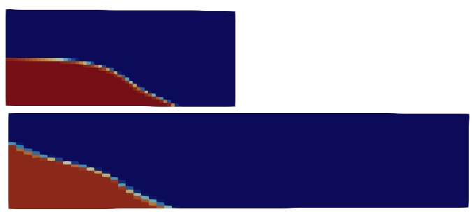

## preCICE耦合两流体域中使用动网格
id:: 687ee99d-f47e-4b5a-9823-d23bf0deb896
collapsed:: true
	- ((6920303d-008c-421a-9bae-d436739cb759))
	  collapsed:: true
		- collapsed:: true
		  >参考
			- ((687ba5b8-0db2-4f10-8f0d-6dddf240b7a0))
- 问题：在两个相邻的流体区域中使用不同的求解器求解，且其中一个网格为动网格，流体具有自由表面
- 在“constant”文件夹添加“dynamicMeshDict”文件，使用“velocityLaplacian”求解器求解动网格；在“0”文件夹添加“pointMotionU”文件，设置法向移动边界为fixedValue，切向移动边界为slip，不移动边界fixedValue值为0；“U”文件中设置法向移动边界为movingWallVelocity，(0 0 0)表示流体相对于此边界静止，其他不变
	- 当“pointMotionU”中使用fixedValue规定法向移动边界时，第一次插值后边界停止移动，cellMotionUx、cellMotionUy和cellMotionUz残差均为变为0；使用uniformFixedValue代替之，则可以持续移动，但移动速度明显偏大，是设定值的100倍
	- 在有初始水体的区域alpha迅速超过1然后崩溃
	- 与单一区域单一求解器结果比较，发现流体没有被真正推动，仍然是按照边界静止的情况溃散的
	  
	- 修改fvSolution中"alpha.*"的nLimiterIter为5似乎可以提高稳定性
	- 这个问题可能与FF求解器不支持重绘网格（remeshing）有关，OpenFOAM adapter当前不支持direct mesh access，因此无法使用实验性remeshing功能 [Direct mesh access support · Issue #349 · precice/openfoam-adapter](https://github.com/precice/openfoam-adapter/issues/349)
- 使用“displacementComponentLaplacian”求解器求解动网格，并指定移动方向；在“0”文件夹添加“pointDisplacementz”和“pointLocation”文件，在“pointDisplacementz”中设置法向移动边界为uniformFixedValue，切向移动边界为slip，不移动边界fixedValue值为0；“pointLocation”中全部为calculate；“U”文件中设置法向移动边界为movingWallVelocity，(0 0 0)表示流体相对于此边界静止，其他不变
	- 边界移动速度符合预期，但同样会迅速崩溃