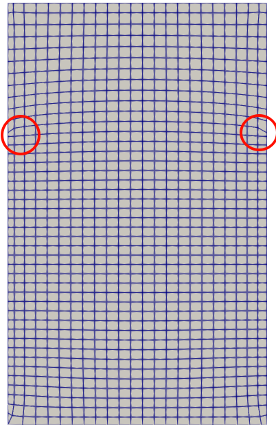

## 动网格分界面网格变形问题
collapsed:: true
	- ((68274234-f87f-4ce0-865f-2164130b5fd0))
- 问题：将侧壁分为上下两段，下段移动上段静止。下段的内部网格停止运动的位置在顶面，而下段的侧壁网格停止移动的位置在中部，导致分界线附近的网格发生畸变，计算崩溃
  {:height 266, :width 171}
- 解决：在constant/dynamicMeshDict中，将diffusivity设置为`directional (100 100 1)`，(100 100 1) 表示在增加网格在xy方向上的刚度，从而阻止网格在z方向的弯曲 [Microsoft Word - rapport.doc - OpenFOAM-rapport.pdf](https://www.tfd.chalmers.se/~hani/kurser/OS_CFD_2007/PiroozMoradnia/OpenFOAM-rapport.pdf)
- 在0/pointMotionU中，将侧壁设置为`zeroGradient;`而非`slip;`
- 在system/fvSolution中，将nNonOrthogonalCorrectors设置为2，nCorrector设置为3，nOuterCorrectors设置为2。对于多相流，建议将correctPhi设置为true。对于高雷诺数流动，建议将momentumPredictor设置为true。 [dynamicmeshes_2021_OF8.pdf](https://www.wolfdynamics.com/training/movingbodies/OF2021/dynamicmeshes_2021_OF8.pdf)
- 在system/fvSchemes中进行如下设置 [dynamicmeshes_2021_OF8.pdf](https://www.wolfdynamics.com/training/movingbodies/OF2021/dynamicmeshes_2021_OF8.pdf)
  
  ``` c++
  FoamFile
  {
  	version	2.0;
  	class	dictionary;
  	format	ascii;
  	location	"system";
  	object	fvSchemes;
  }
  ddtSchemes
  {
  	default	Euler;
  }
  gradSchemes
  {
      default	cellLimited Gauss linear 1.0;
      grad(U) cellLimited Gauss linear 1.0;
  }
  divSchemes
  {
  	default	none;
  	div(rhoPhi,U)	Gauss linearUpwindV grad(U);
  }
  laplacianSchemes
  {
  	default	Gauss linear limited 0.5; //适用于严重变形网格
  }
  interpolationSchemes
  {
  	default	linear;
  }
  snGradSchemes
  {
  	default	limited 0.5; //适用于严重变形网格
  }
  fluxRequired
  {
  	default	no;
  	p_rgh	;
  	pcorr	;
  	alpha	;
  }
  wallDist
  {
  	method	meshWave;
  	nRequired	false;
  }
  ```