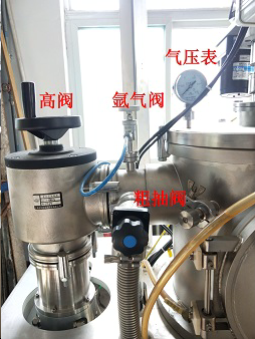

- ## 文字操作步骤
- 准备工作：细节见 ((62b2c442-1321-49ce-abff-c1f0a5e408bf))、 ((62ac3b32-f611-485b-88db-498e4ca859a9))，步骤：总闸->专用闸箱->真空熔炼系统闸->开门放入钛锭和原料（原料根据熔点从高到低自顶到底堆放，各元素熔点见表 [The values of melting temperature of all element](https://phases.imet-db.ru/elements/properties_all.aspx?prop=C1&main=3)）->钨极棒对准钛锭，关门
- 粗抽（可选）
  collapsed:: true
	- 打开机械泵，随后快速向左拧开粗抽阀（蓝色心），拧到头再回拧一点
	- 气压表到-0.1以下，打开真空计，等真空计显示8.0E0左右关闭粗抽阀，真空计和机械泵
- 洗气（可选）
  collapsed:: true
	- 打开粗抽阀上面的氩气阀，气压表接近-0.05，关闭氩气，然后精抽
- 精抽：细节见 ((62ac3b32-f611-485b-88db-498e4ca859a9))，步骤：机械泵->粗抽阀->气压表到-0.1以下真空计->2.0E1左右前级阀->E后面变成0分子泵工作（当真空度降到7.0E0时打开分子泵似乎更有利）->分子泵计数到50关粗抽开高阀->等待20分钟->6.0E-3左右关高阀->关真空计->关分子泵工作->关前级阀
  collapsed:: true
	- #+BEGIN_IMPORTANT
	  如果出现过流警报，说明真空度不够导致分子泵过载，应停止工作检查气密性
	  #+END_IMPORTANT
	- #+BEGIN_IMPORTANT
	  如果精抽到1E-2左右示数不再降低，可以左右拧一下氩气阀门，并不是越紧越好
	  #+END_IMPORTANT
- 充氩气：开氩气到-0.05，同时注意分子泵示数
- 熔钛锭：细节见 ((62b2c62a-9c64-442b-9842-2774e311e19a))，步骤：冷却闸->冷却开关->交流电机箱开关（防止触电）->交流电机闸->等待水循环正常工作->控制把手电弧开关->引弧熔炼3分钟->重复3次
  collapsed:: true
	- collapsed:: true
	  #+BEGIN_IMPORTANT
	  水循环冷却系统报错E45，同时数字不断升高，最后跳闸
	  #+END_IMPORTANT
		- 可能是温度传感器有问题，可以尝试抽出冷却液，更换传感器，使用5k电阻（Cartman）
		- 可能是无法压缩机缺氟导致制冷失败，可找修空调师傅加氟
	- collapsed:: true
	  #+BEGIN_IMPORTANT
	  水循环冷却系统报错E09，并跳闸
	  #+END_IMPORTANT
		- 可能是设定温度与环境温度差距太大，或者工作时间太长（Cartman）
		- 根据环境温度提高或降低设定温度，操作是长按set，听到“滴滴滴”后按up或down调节（Cartman）
		- 环境温度超过30度时每工作1.5小时休息0.5小时
- 熔铸锭：细节见 ((62b2c62a-9c64-442b-9842-2774e311e19a))，步骤：确认关闭交流电机->移动钨极棒对准原料->打开交流电机->第一次熔炼计时3分钟->后续开电磁搅拌计时2分钟->重复5次
  collapsed:: true
	- #+BEGIN_IMPORTANT
	  有时铸锭会在炉子内炸裂
	  #+END_IMPORTANT
		- 可能是相组成为脆性相如BCC（李满天）
		- 可以提高电流10到20 A，以及延长第一次熔炼时间至3分钟（李满天）
	- #+BEGIN_IMPORTANT
	  开了电磁搅拌没看到熔体旋转
	  #+END_IMPORTANT
- 吸铸
  collapsed:: true
	- 吸铸前打磨铸锭氧化皮，先用抛光机装上砂纸打磨边缘，然后取下砂纸打磨残留的黑点，一定要把黑点全部打磨掉。
	- 连接扣，正对元宝螺母耳朵右是紧。
	- 合模具:轻轻摆好，拧上所有螺钉，有错位的地方略微松开调整。
- 取件：细节见 ((62ac3b32-f611-485b-88db-498e4ca859a9))、 ((62ac3b32-f55f-40b8-9b29-1e06736f5246))，步骤：确认关闭交流电机->等待降温，开门取件->关闭冷却->清洁炉内
- ## 视频操作步骤
- [电弧熔炼操作流程_哔哩哔哩_bilibili](https://www.bilibili.com/video/BV1Pr4y147YC?zw&vd_source=fc591008a48bd1bb56b8e3ba9a7c2202)
- {{bilibili https://www.bilibili.com/video/BV1Pr4y147YC?spm_id_from=333.999.0.0}}
- ## 注意事项
- 电源
  id:: 62b2c442-1321-49ce-abff-c1f0a5e408bf
  collapsed:: true
	- 总闸-西侧电源
	- 专用闸箱，从左到右依次为交流电机、真空熔炼系统和水冷系统
	- 专用闸箱钥匙：选择三把钥匙中钥匙齿分布均匀的那一把
- 抽真空系统
  id:: 62ac3b32-f611-485b-88db-498e4ca859a9
  collapsed:: true
	- 拧松放气阀放出气体才能打开熔炼室的门
	- 关门后务必拧紧放气阀
	- 整个熔炼过程中机械泵始终保持打开
	- 开启粗抽阀和高阀动作要快，拧到头以后再回拧一点
	- 示意图
	  {:height 362, :width 303}
- 熔炼
  id:: 62b2c62a-9c64-442b-9842-2774e311e19a
  collapsed:: true
	- 钨极棒顶端对准铸锭或原料中心，并拉开一点间距
	- 对准前务必关闭交流电机，如果交流电机打开，钨极棒误触到金属可能直接引燃
	- 为方便起见，在关闭炉门前就将钨极棒对准钛锭上方
	- 中间的坩埚：眼睛看窗口中心，钨棒尖端和钛锭上沿有一点缝隙，眼睛看窗口上沿，棒顶端和钛锭上沿接触
	- 左侧的坩埚：（待补充）
	- 右侧的坩埚：（待补充）
	- 放电时使电弧打在铸锭上
	- 电流100以下电弧容易乱窜，应迅速提高至100以上
	- 电弧稳定后继续提高电流，钛锭为200，铸锭为300以上
	- 使用电磁搅拌时需要微调
	- 熔炼完一次后提高钨极棒，用铲子将锭翻面，再熔下一次
	- 计时结束后缓慢减小电流到头，关闭电弧开关
	- 熔完一个坩埚后关闭交流电机闸，再关闭机箱开关
- 清洁保养
  id:: 62ac3b32-f55f-40b8-9b29-1e06736f5246
  collapsed:: true
	- 一手持百洁布蘸酒精擦拭铜坩埚，一手持纱布迅速擦干
	- 用百洁布擦拭钨极棒顶端附近，但不能碰到顶端
	- 用纱布蘸酒精擦拭铜坩埚及炉膛四壁
	- TODO 冷却液更换
	- TODO 氩气阀
	  collapsed:: true
		- 拆氩气阀用12号扳手，垫圈用11x2mm的
	- 吸铸模具所用螺母为高型压铸式蝶形螺母
	- 钨极棒用久了可能粘上液滴，需要卸下打磨光滑
	  collapsed:: true
		- 拆卸钨极棒需要用两个8mm扳手一前一后卡住固定钨极棒的螺母才能拧松